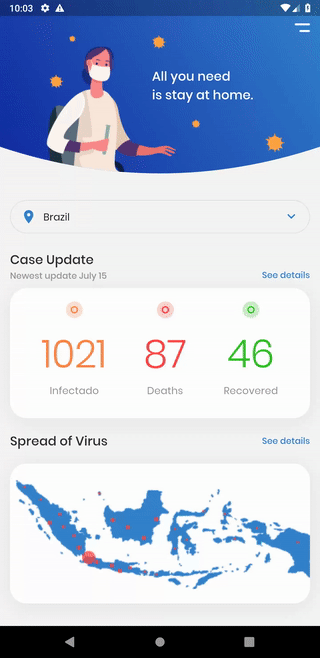

# FLUTTER Covid UI 
- I'm improving my Flutter skills and this is my 3rd project.
- I've used the UI from: [https://www.uplabs.com/posts/coronavirus-information-concept]
- This project was good to improve DrobDownButton/LayoutBuilder/ClipPath widgets skills

 
&#x1f1e7;&#x1f1f7;&#x1f1e7;&#x1f1f7;&#x1f1e7;&#x1f1f7;&#x1f1e7;&#x1f1f7;&#x1f1e7;&#x1f1f7;
 

# Demo

